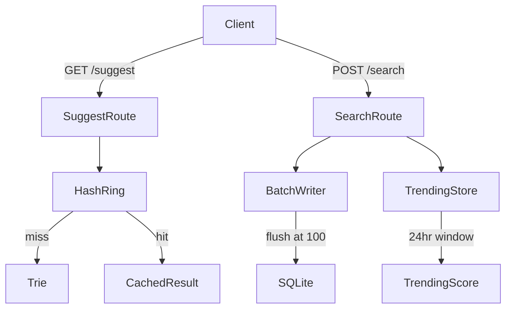

# TypeHead Search

A production-grade typeahead search system with a trie-backed suggestion engine, consistent hash ring cache, batch write buffering, and time-decay trending scores.

---

## Architecture



See [architecture.md](./architecture.md) for the full diagram.

---

## Setup & Run

**Requirements:** Python 3.10+, Node 18+

```bash
# 1. Install backend dependencies
pip install fastapi uvicorn

# 2. Start the backend
cd backend
uvicorn main:app --reload

# 3. In a second terminal, install and start the frontend
cd frontend
npm install
npm run dev
```

Open [http://localhost:5173](http://localhost:5173) in your browser.

**Run backend tests:**
```bash
cd backend
pytest tests/ -v
```

**Run the performance report** (requires backend to be running):
```bash
cd backend
python report.py
```

---

## API Reference

| Method | Endpoint | Description |
|--------|----------|-------------|
| `GET` | `/suggest?q=<prefix>` | Returns up to 10 autocomplete suggestions |
| `POST` | `/search` | Records a search event `{"query": "..."}` |
| `GET` | `/trending` | Returns top 10 trending queries with time-decay scores |
| `GET` | `/cache/debug?prefix=<prefix>` | Inspect cache hit/miss for a prefix |
| `GET` | `/batch/stats` | Returns batch writer buffer stats |

**GET /suggest response:**
```json
{
  "suggestions": [
    { "query": "apple", "count": 4821 },
    { "query": "apple watch", "count": 3102 }
  ]
}
```

**POST /search request:**
```json
{ "query": "iphone" }
```

**GET /trending response:**
```json
{
  "trending": [
    { "query": "iphone", "score": 0.3536 },
    { "query": "macbook", "score": 0.2041 }
  ]
}
```

---

## Design Decisions

**Trie over sorted list** — prefix lookups are O(m) where m is prefix length, independent of corpus size. Each node pre-caches the top 10 suggestions so retrieval is O(m) with no heap.

**Consistent hashing** — three virtual-node cache buckets distribute prefix keys deterministically. Adding/removing nodes only remaps a fraction of keys (as opposed to modular hashing which remaps everything).

**Batch writes** — the `BatchWriter` accumulates up to 100 search events in memory before flushing to SQLite. Multiple searches of the same query collapse into a single `INSERT … ON CONFLICT DO UPDATE`, trading latency for write amplification reduction.

**Time-decay trending** — score = Σ count / (elapsed_hours + 2)^1.5 over a 24-hour sliding window. Older events contribute exponentially less, so recent surges rank above sustained but stale volume.

---

## Performance Results

Run `python backend/report.py` after starting the server to generate live measurements.
Results are also saved to `backend/performance_report.txt`.
