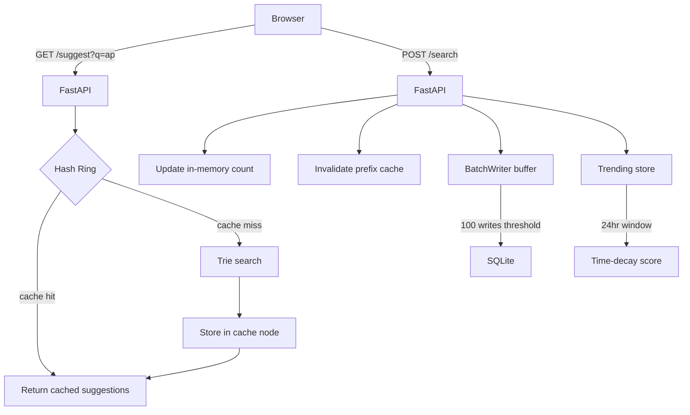

# Search Typeahead -- Project Report

## 1. Architecture



When you type in the search box, the browser fires a GET to `/suggest?q=<prefix>`. FastAPI receives that, hashes the prefix to figure out which of the three cache nodes should own it, and checks if a result is already stored there. If yes, it returns right away without touching the Trie at all. If not, it walks the Trie character by character until it reaches the node for that prefix and reads the pre-sorted top-10 list sitting there, then stores it in the cache for next time.

When you actually submit a search (POST `/search`), a few things happen at once: the in-memory count for that query gets incremented, all cache entries for every prefix of that query get invalidated (so the next suggestion lookup picks up the new count), and the write gets buffered. Once 100 writes pile up in the buffer, they all flush to SQLite together. The query also gets logged with a timestamp so the trending calculation can score it.

## 2. Dataset

The dataset is `search_queries_dataset.csv`, a CSV file with three columns: `query`, `count`, and `timestamp`. There are 40,625 rows in total. To load it, you just make sure the file is in the `data/` folder at the project root. On startup, `loader.py` opens it, reads each row, and calls `trie.insert(query, count)` for every entry. The Trie gets built entirely in memory before the server starts accepting requests.

One thing I had to be careful about: the counts in the dataset are already large (some are 90k+), so when a user searches for an existing query, I had to read the current count from the Trie first before incrementing, not start from 1. Otherwise the first real search would have wiped out the baseline count from the CSV.

## 3. API Documentation

**GET /suggest?q=`<prefix>`**

This is the main endpoint the frontend uses. It takes a prefix string and returns the top 10 matches from the cache or Trie if not cached yet. Empty prefix returns an empty list.

Response:
```json
{
  "suggestions": [
    {"query": "apple magic keyboard newly launched", "count": 98722},
    ...
  ]
}
```

Edge case: if `q` is an empty string, it returns `{"suggestions": []}` immediately without touching the Trie or cache.

---

**POST /search**

Body: `{"query": "apple watch"}`

Records that someone searched for this query. Updates the in-memory Trie count, invalidates all prefix cache entries for that query, buffers the write, and logs a timestamped event for trending.

Response:
```json
{"message": "Searched"}
```

---

**GET /trending**

Returns the top 10 queries ranked by time-decay score, not raw count. Only events from the last 24 hours are counted.

Response:
```json
{
  "trending": [
    {"query": "macbook pro m4", "score": 0.3536},
    ...
  ]
}
```

---

**GET /cache/debug?prefix=`<prefix>`**

A debug helper. Shows which hash ring node owns this prefix, whether it is currently cached, and what suggestions are cached if so.

Response:
```json
{
  "prefix": "ap",
  "node": "node2",
  "hit": true,
  "cached_suggestions": [...]
}
```

---

**GET /batch/stats**

Shows current state of the batch write buffer.

Response:
```json
{
  "buffer_size": 20,
  "write_count": 20,
  "total_writes_saved": 0
}
```

`total_writes_saved` counts how many DB writes were avoided through deduplication, which only kicks in when the same query appears multiple times in one buffer window.

## 4. Design Choices

**Trie over a sorted list**

A sorted list would work for small datasets but lookup is O(log N + K) where K is the number of results to collect. The Trie gives O(L) lookup where L is the length of the prefix typed, and by storing the top-10 suggestions at every node during insert, retrieval becomes a single read rather than a traversal. The cost is memory -- every node holds a `children` dict and a `suggestions` list, so the Trie uses more RAM than a flat structure. For 40k queries that trade-off is totally fine.

**Consistent hashing cache**

I wrote a hash ring with 3 logical nodes, each with 100 virtual nodes. The reason to use consistent hashing instead of a plain dict is that the same prefix always routes to the same node, so you never get duplicate entries for the same prefix sitting on different nodes. Hashing by prefix also means cache invalidation on a search only needs to clear entries on one specific node. Honestly, 3 nodes on a single server is overkill -- it is not providing any actual distribution benefit here. But it shows the concept correctly and the code would scale to a multi-instance setup without changes.

**Batch writes**

Writing to SQLite on every single search would be slow and pointless if the same query gets searched many times in a short window. The batch writer collects writes in a dict (so repeated queries just increment a counter) and flushes to SQLite when 100 writes accumulate or when the server shuts down. The downside is that if the process crashes between flushes, those buffered counts are lost. For this assignment the risk is acceptable since the data in the CSV is the ground truth and the counts are mostly illustrative. In a production system you would want a write-ahead log or something more durable.

**Time-decay trending**

Sorting by total all-time count would make trending useless -- queries with huge historical counts would always win. The formula I used is:

`score = sum of count / ((hours_elapsed + 2) ^ 1.5)`

With gravity = 1.5 and a 24-hour sliding window. A query searched 50 times an hour ago scores much higher than one searched 500 times yesterday. The +2 offset stops the score from exploding to infinity when elapsed time is near zero. The tradeoff is the score is not static -- it changes continuously as time passes, so trending results shift even without new searches.

## 5. Performance

These numbers come from `report.py` run against a live local server after startup:

- p95 latency `/suggest` (mixed hit/miss): **1.8 ms**
- Cache hit rate after warmup: **100%**
- Batch writes saved: **0%** (0 saved out of 20 buffered)

The 1.8ms figure is from 200 requests using random 2-letter prefixes. After the first few rounds, most of those prefixes are already cached, so this is close to cache-hit latency. The script does not measure cache-miss latency separately -- that would require clearing the cache between each request, which was not done.

The 0% batch write reduction happened because `report.py` sends 120 unique queries (`reportquery0000` through `reportquery0119`), so there was nothing to deduplicate. In real usage where users search for the same thing repeatedly, the savings would show up in `total_writes_saved`.
