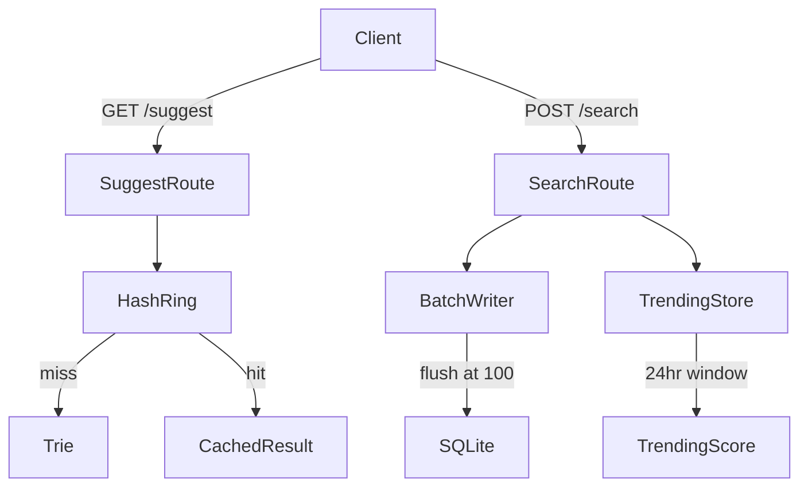

# Architecture

## Components

| Component | File | Responsibility |
|-----------|------|----------------|
| Trie | `backend/data/trie.py` | Prefix search, top-10 per node |
| Loader | `backend/data/loader.py` | CSV → Trie on startup |
| HashRing | `backend/cache/hash_ring.py` | Consistent hashing cache |
| BatchWriter | `backend/batch/writer.py` | Buffered SQLite writes |
| SQLite store | `backend/db/store.py` | Persistence layer |
| SuggestRoute | `backend/routes/suggest.py` | GET /suggest |
| SearchRoute | `backend/routes/search.py` | POST /search |
| TrendingRoute | `backend/routes/trending.py` | GET /trending |
| BatchStats | `backend/routes/batch_stats.py` | GET /batch/stats |
| CacheDebug | `backend/routes/cache_debug.py` | GET /cache/debug |
